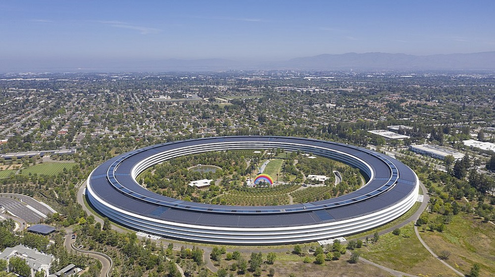

<!DOCTYPE html>
<html lang="en">
<head>
  <title>APPLE COMPANY</title>
  <meta charset="utf-8">
  <meta name="viewport" content="width=device-width, initial-scale=1">
  <link rel="stylesheet" href="https://maxcdn.bootstrapcdn.com/bootstrap/4.0.0/css/bootstrap.min.css" integrity="sha384-Gn5384xqQ1aoWXA+058RXPxPg6fy4IWvTNh0E263XmFcJlSAwiGgFAW/dAiS6JXm" crossorigin="anonymous">
</head>
  
  
</head>
<body>

  <nav class="navbar navbar-expand-lg navbar-light bg-dark">
    <ul class=navbar-nav>
        <li class="nav-item active">
            
<a href="awesome.html" class=" nav-link text-white bg-dark">Home</a>

        </li>
        <li class="nav-item active">
            
<a href="about.html" class=" nav-link text-white bg-dark">About Us</a>

        </li>
        <li class="nav-item active">
            
<a href="contact.html" class=" nav-link text-white bg-dark">Contact Us</a>

        </li>
    </ul>
</nav>
<h1>Welcome TO APPLE</h1>

  

      

          

          

          
Apple Inc. is an American multinational technology company headquartered in Cupertino, California, that designs, develops, and sells consumer electronics, computer software, and online services. It is considered one of the Big Four tech companies along with Amazon, Google, and Facebook
            Lorem ipsum dolor sit amet, consectetur adipiscing elit, sed do eiusmod tempor incididunt ut labore et dolore magna aliqua. Ut enim ad minim veniam, quis nostrud exercitation ullamco laboris nisi ut aliquip ex ea commodo consequat. Excepteur sint occaecat cupidatat non proident, sunt in culpa qui officia deserunt mollit anim id est laborum consectetur adipiscing elit, sed do eiusmod tempor incididunt ut labore et dolore magna aliqua. Ut enim ad minim veniam, quis nostrud exercitation ullamco laboris nisi ut aliquip ex ea commodo consequat.

            Software Development,The development of reliable and scalable software solutions for any OS, browser and device. We bring together deep industry expertise and the latest IT advancements to deliver custom solutions and products that perfectly fit the needs and behavior of their users.
             Software consulting,
              Custom software development,
              Software product development,
              Software development outsourcing.
              Apple was founded by Steve Jobs, Steve Wozniak, and Ronald Wayne in April 1976 to develop and sell Wozniak's Apple I personal computer, though Wayne sold his share back within 12 days. It was incorporated as Apple Computer, Inc., in January 1977, and sales of its computers, including the Apple II, grew quickly. Within a few years, Jobs and Wozniak had hired a staff of computer designers and had a production line. Apple went public in 1980 to instant financial success. Over the next few years, Apple shipped new computers featuring innovative graphical user interfaces, such as the original Macintosh in 1984, and Apple's marketing advertisements for its products received widespread critical acclaim. However, the high price of its products and limited application library caused problems, as did power struggles between executives. In 1985, Wozniak departed Apple amicably and remained an honorary employee,[8] while Jobs and others resigned to found NeXT.[9]. As the market for personal computers expanded and evolved through the 1990s, Apple lost market share to the lower-priced duopoly of Microsoft Windows on Intel PC clones. The board recruited CEO Gil Amelio to what would be a 500-day charge for him to rehabilitate the financially troubled company—reshaping it with layoffs, executive restructuring, and product focus. In 1997, he led Apple to buy NeXT, solving the desperately failed operating system strategy and bringing Jobs back. Jobs pensively regained leadership status, becoming CEO in 2000. Apple swiftly returned to profitability under the revitalizing Think different campaign, as he rebuilt Apple's status by launching the iMac in 1998, opening the retail chain of Apple Stores in 2001, and acquiring numerous companies to broaden the software portfolio. In January 2007, Jobs renamed the company Apple Inc., reflecting its shifted focus toward consumer electronics, and launched the iPhone to great critical acclaim and financial success. In August 2011, Jobs resigned as CEO due to health complications, and Tim Cook became the new CEO. Two months later, Jobs died, marking the end of an era for the company. In June 2019, Jony Ive, Apple's CDO, left the company to start his own firm, but stated he would work with Apple as its primary client.
              Apple is well known for its size and revenues. Its worldwide annual revenue totaled $265 billion for the 2018 fiscal year. Apple is the world's largest technology company by revenue and one of the world's most valuable companies. It is also the world's third-largest mobile phone manufacturer after Samsung and Huawei.[10] In August 2018, Apple became the first public U.S. company to be valued at over $1 trillion.[11][12] The company employs 123,000 full-time employees[13] and maintains 504 retail stores in 24 countries as of 2018.[14] It operates the iTunes Store, which is the world's largest music retailer. As of January 2018, more than 1.3 billion Apple products are actively in use worldwide.[15] The company also has a high level of brand loyalty and is ranked as the world's most valuable brand. However, Apple receives significant criticism regarding the labor practices of its contractors, its environmental practices and unethical business practices, including anti-competitive behavior, as well as the origins of source materials.

             

     

          
                          
      

  

<footer class="container-fluid text-auto">
  Apple was founded by Steve Jobs, Steve Wozniak, and Ronald Wayne in April 1976 to develop and sell Wozniak's Apple I personal computer.This makes sense only if you are active within that network and have solid editorial standards about what you’re sharing.
                
</footer>

        
        
</body>
</html>
